# Legacy Voice Call Audio Lifecycle

## Observed flow

```mermaid
flowchart LR
    A["getUserMedia<br/>16 kHz mono"] --> B["ScriptProcessor 4096<br/>RMS VAD"]
    B --> C{"AI playback buffer<br/>or 400 ms tail?"}
    C -->|"yes"| D["Run local VAD<br/>drop mic upload"]
    C -->|"no"| E["Float32 to PCM16LE"]
    E --> F["WebSocket binary frame"]
    F --> G["Fastify route RMS VAD"]
    G --> H["Deepgram WS<br/>linear16 16 kHz mono"]
    H --> I["interim/final transcript"]
    I --> J["Legacy VoicePipeline / brain"]
    J --> K["MiniMax legacy TTS"]
    K --> L["MP3 binary chunks"]
    L --> M["Accumulate entire MP3"]
    M --> N["decodeAudioData whole stream"]
    N --> O["append new Float32 PCM"]
    O --> P["ScriptProcessor 2048<br/>24 kHz ring-like queue"]
    P --> Q["Gain / speaker output"]
    I --> R["interrupt / fade-out"]
    R --> S["mute backend sender + audio:fadeout"]
    S --> T["300 ms ramp then clear MP3/PCM/context"]
```

## Capture and upload

- `getUserMedia`: requested 16 kHz, mono, browser echo cancellation enabled, noise suppression off,
  AGC on (`frontend/src/hooks/useAudio.ts:151-168`). `VERIFIED`.
- Capture API: `createScriptProcessor(4096, 1, 1)` (`useAudio.ts:170-176`). At 16 kHz this is
  approximately 256 ms per callback. `INFERRED` from configured rate and buffer size.
- VAD: RMS; normal threshold 0.04 with three loud chunks, AI playback threshold 0.15 with four
  chunks; speech-end timer 1,500 ms (`useAudio.ts:181-207`). `VERIFIED`.
- Encoding: Float32 samples clamp and convert to signed PCM16; browser sends raw `ArrayBuffer`
  (`useAudio.ts:217-225`, `useWebSocket.ts:204-209`). Endianness follows platform TypedArray and is
  assumed little-endian by backend `Int16Array`; it is not negotiated. `VERIFIED`/`INFERRED`.
- Backend route documents and consumes PCM 16 kHz, mono, 16-bit and always forwards received binary
  frames to the pipeline (`backend/routes/voice-call.ts:219-241`). `VERIFIED`.
- Critical gating: when decoded PCM remains or the 400 ms tail window is active, processing returns
  before `onAudioChunk`; local VAD still runs (`useAudio.ts:209-225,512-513`). AI-time audio is not
  continuously uploaded. `VERIFIED`.

## ASR

- Deepgram streaming configuration: Nova-3, `linear16`, 16 kHz, one channel, interim results,
  endpointing default 500 ms, utterance end default 1,200 ms
  (`backend/modules/streaming-asr.ts:95-139`). `VERIFIED`.
- Pre-connect audio is accumulated in an unbounded `pendingAudio` array and flushed on connection
  (`streaming-asr.ts:65-70,153-158,257-270`). Memory cap: none observed. `VERIFIED`.
- Reconnect: up to five exponential attempts; pending/accumulated text behavior is local to this
  client (`streaming-asr.ts:79-99,227-254`). `VERIFIED`.
- Interim text drives hearing state and interruption after confidence/echo checks; final text drives
  response generation (`voice-pipeline.ts:233-387`). `VERIFIED`.

## TTS and receive format

- The WS engine emits MP3 decoded from provider hex at 24 kHz mono
  (`minimax-realtime.ts:185-200,319-338`). It incorrectly assumes the connection can serve repeated
  tasks. `VERIFIED`.
- The HTTP engine comments claim PCM but the current request explicitly asks for MP3, 24 kHz mono
  (`minimax-tts.ts:1-11,322-327`). `VERIFIED`.
- The formal PLM evidence remains Task 002: MP3, 24 kHz, mono. PCM provider behavior remains
  `UNKNOWN` and must not be inferred from the legacy comments.

## Browser playback

- Incoming binary frames are delivered directly to `playAudioChunk`; JSON `audio:stream` base64 is
  a fallback (`useWebSocket.ts:112-135`, `App.tsx:58-64`). `VERIFIED`.
- MP3 chunks are retained for the whole current utterance; after 2,048 bytes, or a 40 ms timer,
  the entire accumulated MP3 is decoded again (`useAudio.ts:374-467`). `VERIFIED`.
- Only samples after `decodedSamplesRef` are appended to an array of `Float32Array` buffers. A
  `ScriptProcessor(2048)` drains them at a requested 24 kHz, mono, filling underruns with silence
  (`useAudio.ts:291-372,404-430`). `VERIFIED`.
- This is described as a ring buffer but is actually an array/slice queue. MP3 accumulation has no
  explicit byte cap. `VERIFIED`.
- `audio:done` performs a final decode/drain; `audio:clear` immediately stops and discards
  (`App.tsx:62-72`, `useAudio.ts:469-520`). `VERIFIED`.
- Filler MP3 files are expected at `/audio/fillers/filler-0.mp3` through `filler-11.mp3`, but these
  assets are absent from the 43-file package. Runtime filler completeness is `UNKNOWN`.

## Interruption

- Browser local VAD sends `audio:interrupt` when UI state is `speaking`, starts local fade-out and
  sets local `interrupting` (`App.tsx:30-37`). `VERIFIED`.
- Backend interim transcript can also call `interrupt()` after confidence and text-echo checks
  (`voice-pipeline.ts:239-270`). `VERIFIED`.
- Interrupt mutes the legacy TTS sender immediately, sends `audio:fadeout`, marks state idle, then
  aborts the TTS stream after 300 ms (`voice-pipeline.ts:891-958`). `VERIFIED`.
- Browser ramps gain to zero for 300 ms, then clears MP3/PCM and closes playback context
  (`useAudio.ts:522-552`). `VERIFIED`.
- There is no cross-boundary generation ID. The legacy WS TTS has only a process-global numeric
  counter; frontend playback cannot identify or discard a stale generation. `VERIFIED`.

## Cleanup and memory

- `stopMic` disconnects processor/source, closes context, stops tracks and clears VAD state
  (`useAudio.ts:238-257`). `VERIFIED`.
- `stopPlayback` clears MP3 arrays, decoded counters, PCM queue, processor and context
  (`useAudio.ts:484-520`). `VERIFIED`.
- Component unmount clears the VAD/flush timers, closes contexts and stops tracks
  (`useAudio.ts:652-669`). `VERIFIED`.
- Legacy backend recording has a 20 MiB cap, but browser MP3 accumulation and ASR pre-connect audio
  have no observed caps (`voice-pipeline.ts:160-169`; `useAudio.ts:54-60`; `streaming-asr.ts:65-70`).
  `VERIFIED`.

## Required replacement behavior

- AudioWorklet or equivalent capture/playback boundary instead of the combined ScriptProcessor hook.
- Mic upload continues during AI playback; echo/AEC and floor decisions occur without frontend
  gating.
- Explicit input format negotiation and versioned binary framing.
- Generation ID on every output/control path; clear and discard stale data synchronously.
- Bounded compressed, decoded and pre-connect buffers.
- Separate `flush/drain`, `clear`, `fade`, `cancel request` and `connection close` semantics.
- Deterministic cleanup tests for hangup, reconnect, permission denial and component unmount.

These are extraction recommendations only. Implementation requires human approval.
