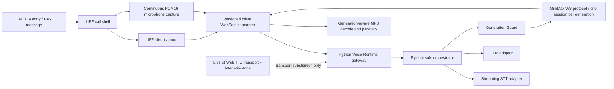

# LINE OA Voice Call Integration Blueprint

## 1. Decision and boundary

Status: `DESIGN_COMPLETE_NOT_IMPLEMENTED`

This blueprint combines the useful LINE OA / LIFF call experience with the PLM runtime without
adopting the legacy TypeScript pipeline. It does not authorize extraction, Task 004, a production
MiniMax service, a Pipecat pipeline, or LiveKit integration.

Non-negotiable decisions:

- Pipecat is the only dialogue and floor-state orchestrator.
- LiveKit, when authorized, is transport only; LiveKit Agents are not introduced.
- MiniMax WebSocket TTS is the only production voice output engine.
- The legacy reference repository remains ignored, read-only, and outside the runtime.
- Task 002 evidence controls provider behavior: one MiniMax WebSocket session per generation.
- Browser microphone upload must continue while assistant audio is playing.
- Closing a socket is an engineering stop mechanism, not proof of provider-side cancellation.

## 2. Target end-to-end topology



The first integration must use the direct LIFF WebSocket boundary shown above. A later authorized
LiveKit milestone may replace the media transport boundary but cannot take ownership of dialogue,
TTS, floor state, or session orchestration.

## 3. Integration nodes and contracts

| Node | Input | Output | Owner | Required design rule |
|---|---|---|---|---|
| LINE OA trigger | LINE user interaction | Signed LIFF launch URL or approved Flex action | LINE adapter | No secret or trusted user identity in query parameters |
| LIFF shell | Browser gesture and LIFF SDK state | Call UI state and identity token | Frontend | Reuse visual components; adapt LIFF init and error handling |
| Identity exchange | LIFF ID/access token | Server-derived principal and short-lived call grant | Gateway | Never trust a client-provided LINE user ID |
| Call WebSocket | Authenticated call grant and protocol v1 frames | Ordered call/control/audio events | Frontend + gateway | Reject missing/unknown versions and oversized frames |
| Mic capture | MediaStream | PCM16LE, 16 kHz, mono frames | Frontend audio layer | AudioWorklet preferred; upload continues during playback |
| Session registry | Authenticated principal + call ID | One active call lease and idempotent cleanup | Python runtime | Duplicate calls close the prior lease without deleting the new one |
| Pipecat runtime | Audio/control frames | STT/LLM/TTS frames and canonical floor state | Python runtime | Sole orchestrator and sole state owner |
| STT adapter | PCM audio | Interim/final transcript frames | Provider adapter | Bounded pre-connect queue, reconnect policy, no raw transcript logs |
| LLM adapter | Final transcript + approved context | Incremental text frames | Provider adapter | No legacy `voice-brain` orchestration or hidden second judge |
| Generation Guard | Generation lifecycle events | Active-generation admission decisions | Python runtime | Discard all late text/audio/control from stale generations |
| MiniMax protocol | Text chunks and finish | MP3 chunks/events | Python runtime | Two short continues are supported; one WS session per generation |
| Browser decoder | Generation-tagged MP3 | Bounded decoded PCM queue | Frontend audio layer | A chunk may be incomplete; decode, flush, drain and clear are distinct |
| Playback | PCM queue + control events | Speaker output and drain ACK | Frontend audio layer | Hard clear on interrupt; bounded fade is UX only |
| Observability | Redacted state/timing events | Metrics and audit trail | Runtime | No token, key, Voice ID, prompt, transcript, raw event or audio |

## 4. Protocol v1 proposal

Every JSON frame has this common envelope:

```json
{
  "protocol_version": "1",
  "type": "call.start",
  "session_id": "opaque-server-issued-id",
  "message_id": "client-unique-id",
  "sequence": 1,
  "generation_id": null,
  "payload": {}
}
```

Required client events:

- `call.start`: consumes a short-lived server-verifiable call grant; it never carries trusted
  identity fields.
- `audio.input`: an explicit binary envelope or negotiated binary channel containing sequence,
  timestamp, PCM16LE/16 kHz/mono format and payload length.
- `generation.interrupt`: targets one `generation_id` and is idempotent.
- `playback.drained`: confirms the browser drained one generation.
- `call.end`: requests idempotent session teardown.
- `heartbeat`: application health only if transport ping/pong is insufficient.

Required server events:

- `call.ready`: confirmed session, negotiated media formats and limits.
- `state.changed`: canonical Pipecat-derived floor state revision.
- `transcript.partial` / `transcript.final`: optional product-visible projections, redacted from
  logs by default.
- `audio.output`: generation-tagged MP3 payload with monotonic sequence.
- `generation.finished`: provider lifecycle complete; does not imply browser playback drained.
- `playback.clear`: hard discard for a specific generation.
- `call.ended`: teardown acknowledgement.
- `error`: `{code, message, retryable, trace_id}` with safe public messages.

Ordering and recovery rules:

- Sequence numbers are monotonic per direction and session; duplicates are idempotently ignored.
- Unknown versions, stale generations and identity mismatches fail closed.
- Reconnect creates a new transport lease; resumption is allowed only with an explicit resume token
  and bounded replay window. Provider generation sessions are never resumed or pooled.
- JSON, binary frame, queue duration and total buffer limits are negotiated and enforced.

## 5. Audio and interruption lifecycle

1. A browser gesture obtains mic permission and creates capture/playback AudioWorklets.
2. The client uploads PCM16LE/16 kHz/mono continuously, including while MP3 is playing.
3. Browser AEC is requested; transcript-similarity filtering may be auxiliary evidence only.
4. Pipecat owns `LISTENING → THINKING → SPEAKING → INTERRUPTING` transitions.
5. A confirmed interruption atomically invalidates the active generation locally.
6. The runtime stops accepting provider chunks, closes that generation's socket, and sends
   `playback.clear`. This does not claim server-side billing cancellation.
7. The browser immediately rejects mismatched-generation chunks, clears compressed and decoded
   queues, and may apply a short bounded fade before hard clear.
8. A new response receives a new generation ID and a new MiniMax WebSocket session.
9. Hangup closes tracks, worklets, AudioContexts, timers, sockets and bounded queues idempotently.

Formal output format from Task 002 is MP3, 24 kHz, mono. PCM provider output remains unknown and is
not an integration assumption. Individual MP3 chunks need not independently represent a complete
decodable asset; the decoder must support incremental accumulation and final flush.

## 6. State and ownership

Only Pipecat may mutate the canonical call/floor state. Frontend state is a revisioned projection,
not an independent decision engine. Provider adapters publish typed events but never advance the
dialogue themselves. The legacy `voice-pipeline`, `voice-brain`, `voice-judge`, `tts-player`, and
MiniMax connection pool therefore cannot be copied as orchestrators.

Each runtime object has one scope:

- principal: authenticated LINE identity;
- call session: browser call lifetime;
- transport lease: one active WebSocket connection;
- turn: one user/assistant exchange;
- generation: one MiniMax WebSocket session and one playback buffer namespace.

## 7. Security and configuration

- All provider credentials, LINE secrets and Voice IDs come from runtime environment variables or
  an approved secret manager; none are sent to the browser.
- The gateway validates a LIFF token with LINE and derives identity server-side before allocating a
  session. Exact verification endpoints and token claims must be checked against current official
  LINE documentation during the authorized implementation milestone.
- Call grants are short-lived, audience-bound, single-purpose and protected against replay.
- Origin, rate, payload-size and concurrent-call limits apply before expensive provider work.
- Logs contain event type, safe error code, durations, byte counts, hashes where necessary and
  internally generated trace IDs only. They exclude authorization headers, provider raw bodies,
  Voice IDs, prompts, transcripts, user IDs and audio.
- Public Git excludes `.env*`, audio, provider timelines/results and the complete reference clone.

## 8. Reliability and observability

Minimum measurements per call:

- identity exchange, WebSocket connect and call-ready latency;
- input audio queue depth and dropped-frame count;
- STT partial/final latency;
- LLM first-token latency;
- MiniMax connect latency and TTFA per generation;
- compressed and decoded playback queue depth;
- interruption-to-local-clear latency;
- stale generation chunks discarded;
- close reason, structured error code and cleanup completion.

All waits are bounded. Provider authentication, invalid model/voice, protocol drift, budget risk,
unbounded queues and redaction failure are fail-closed conditions.

## 9. Deployment boundary

The deployable units must remain separable:

- LIFF static frontend: public configuration only, feature-flagged call entry.
- Python Voice Runtime: authentication gateway, Pipecat orchestration and provider adapters.
- Optional later LiveKit infrastructure: media transport credentials and rooms only.

The frontend never calls MiniMax directly. The Python runtime never imports the legacy TypeScript
pipeline. A LiveKit deployment must use persona-specific secrets and endpoints and must not share
ambiguous credentials across environments.

## 10. Approved extraction sequence after future human gates

### Stage 1 — Isolated LIFF shell

Extract/adapt `CallScreen`, `BreathingOrb`, `Waveform`, `MicPermission`, `DialTone` and LIFF startup.
No backend, audio hook or provider code. Acceptance: login/error/mic-gesture UI tests and a backend-
free feature flag. Rollback: remove the isolated frontend route.

### Stage 2 — Protocol and authenticated Python boundary

Implement protocol schemas, token exchange, session registry and contract tests. No provider or
Pipecat production pipeline. Acceptance: version/auth/order/duplicate/size/reconnect/error tests.
Rollback: disable protocol v1 and retain the UI shell.

### Stage 3 — Audio and generation-aware playback

Implement continuous AudioWorklet capture, bounded MP3 decode/playback and hard interruption only
after Generation Guard and formal MiniMax service milestones are authorized. Acceptance: capture
continues during playback, stale audio is impossible to play, every buffer is bounded, deterministic
cleanup passes, and latency budgets are measured. Rollback: disable audio while preserving Stage 2.

### Stage 4 — Transport substitution, if required

Introduce LiveKit only as a Pipecat WebRTC transport after direct-WebSocket behavior is stable.
Acceptance: orchestration ownership and application protocol semantics remain unchanged. Rollback:
return to the direct transport adapter.

Each stage requires a separate human approval, focused implementation diff, tests, security scan,
and rollback demonstration. Stages must not be collapsed into a wholesale legacy copy.

## 11. Release gates

Integration cannot be called complete until all of the following are evidenced:

- authenticated LINE identity and replay-resistant call grants;
- schema/contract coverage for every protocol frame;
- continuous mic upload during assistant playback;
- one MiniMax session per generation;
- stale generation rejection before decode and playback;
- bounded queues and deterministic teardown;
- no second orchestrator or LiveKit Agents dependency;
- redaction tests and public-repository secret scan;
- latency, interruption and failure-mode acceptance records;
- independent rollback for every extraction stage.

Current stop condition: `NEEDS_HUMAN_POST_PUBLISH_REVIEW` after the safe initial repository publish.
